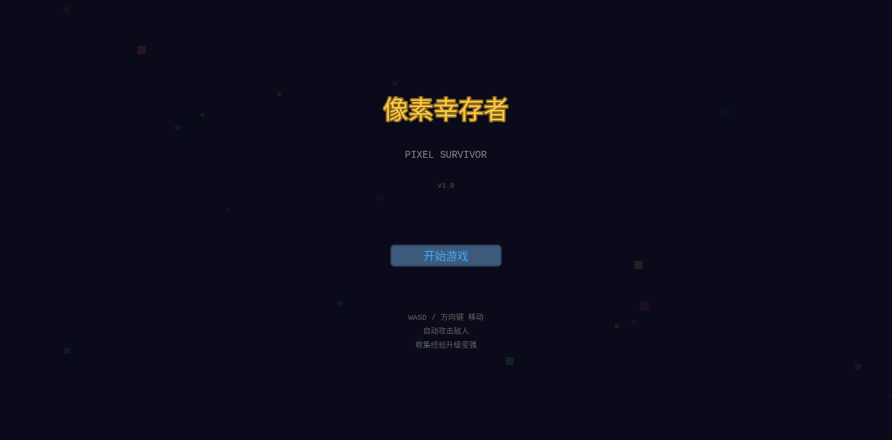

# 🎮 像素幸存者 (Pixel Survivor)

一款基于 WebGL 的网页端割草小游戏，使用 Phaser 3 + TypeScript 开发。无需下载安装，打开浏览器即可畅玩！



## ✨ 功能特性

### 🗡️ 核心玩法
- **自动攻击** — 角色自动释放武器，玩家只需控制移动方向
- **海量敌人** — 同屏 200+ 怪物，体验割草快感
- **升级系统** — 击杀怪物获取经验，升级时从 3 个随机选项中选择强化
- **5 分钟关卡** — 存活到倒计时结束即为胜利

### ⚔️ 4 把武器
| 武器 | 描述 |
|------|------|
| 🗡️ 旋转飞刀 | 环绕角色旋转，接触即伤 |
| 🔵 能量弹 | 自动追踪最近敌人 |
| ⚡ 闪电链 | 随机电弧跳跃，连锁伤害 |
| 🔥 火焰瓶 | 投掷燃烧瓶，落地范围爆炸 |

### 👾 4 种敌人
| 敌人 | 行为 |
|------|------|
| 🟢 史莱姆 | 追踪玩家 |
| 🟤 僵尸 | 追踪，高血量 |
| 👻 幽灵 | 间歇性高速冲刺 |
| 💀 骷髅法师 | 保持距离远程弹幕 |
| 👑 巨型史莱姆 | BOSS，每 60 秒出现 |

### 📈 10 种被动技能
最大生命、移动速度、拾取范围、经验加成、护甲、回血、暴击率、暴击伤害、冷却缩减、武器栏位

### 🎵 8-bit 背景音乐
程序化生成的芯片音乐（Chiptune），无需外部音频文件

### 📱 双端兼容
- PC：WASD / 方向键移动
- 移动端：虚拟摇杆触控操作

## 🛠️ 技术栈

| 技术 | 用途 |
|------|------|
| **Phaser 3** | 2D 游戏引擎 |
| **TypeScript** | 开发语言 |
| **Vite** | 构建工具 |
| **Web Audio API** | 程序化音乐合成 |

### 核心架构
- **空间哈希网格 (Spatial Hash)** — 高效碰撞检测，O(n) 复杂度
- **对象池 (Object Pool)** — 减少 GC 压力
- **程序化像素素材** — 运行时生成所有图形，零外部资源依赖
- **数据驱动设计** — 武器/敌人/技能数据表化，方便调整平衡

## 🚀 快速开始

### 环境要求
- Node.js >= 18
- npm >= 9

### 安装与运行

```bash
# 1. 克隆仓库
git clone https://github.com/<你的用户名>/pixel-survivor.git
cd pixel-survivor

# 2. 安装依赖
npm install

# 3. 启动开发服务器
npm run dev

# 4. 打开浏览器访问
# http://localhost:3000
```

### 构建生产版本

```bash
npm run build
```

构建产物在 `dist/` 目录，可部署到任何静态文件服务器。

## 📁 项目结构

```
pixel-survivor/
├── src/
│   ├── main.ts                    # 游戏入口
│   ├── config/
│   │   ├── GameConfig.ts          # 游戏常量配置
│   │   └── GameData.ts            # 武器/敌人/技能数据表
│   ├── assets/
│   │   └── PixelAssets.ts         # 程序化像素素材生成器
│   ├── entities/
│   │   ├── Player.ts              # 玩家实体
│   │   ├── Enemy.ts               # 敌人实体
│   │   ├── Projectile.ts          # 投射物实体
│   │   ├── PickupItem.ts          # 拾取物实体
│   │   └── FloatingText.ts        # 浮动伤害数字
│   ├── systems/
│   │   ├── WeaponManager.ts       # 武器管理器
│   │   └── MusicManager.ts        # 8-bit 音乐合成器
│   ├── scenes/
│   │   ├── BootScene.ts           # 启动场景（素材生成）
│   │   ├── MenuScene.ts           # 主菜单
│   │   ├── GameScene.ts           # 核心游戏场景
│   │   └── ResultScene.ts         # 结算场景
│   └── utils/
│       ├── MathUtils.ts           # 数学工具函数
│       ├── ObjectPool.ts          # 对象池
│       └── SpatialHash.ts         # 空间哈希碰撞检测
├── index.html
├── package.json
├── tsconfig.json
├── vite.config.ts
└── README.md
```

## 🎮 操作说明

| 平台 | 移动 | 攻击 | 暂停 |
|------|------|------|------|
| **PC** | WASD / 方向键 | 自动 | ESC / P |
| **移动端** | 虚拟摇杆（左下角） | 自动 | 点击暂停按钮 |

## 📄 License

MIT License
